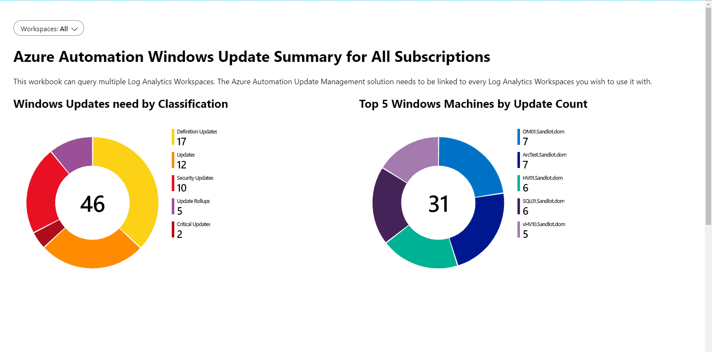
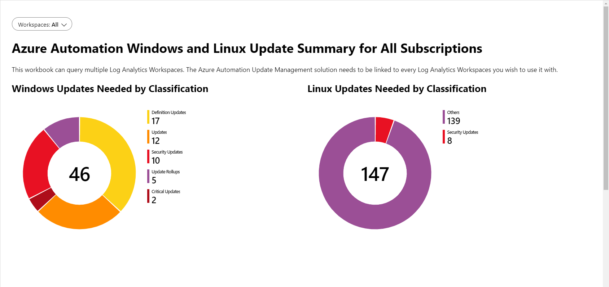
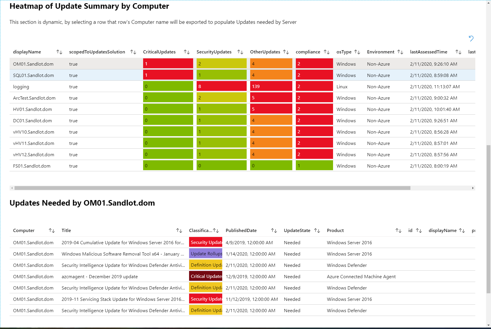

# Azure Monitor Update Management Patch Compliance Workbooks

The purpose of these Azure Monitor Workbooks is to provide patch compliance reporting for multiple Log Analytics workspaces.

To use them you need:
- Log Analytics workspace
- Azure Automation account
- Update Management Solution
- Azure Monitor Workbooks

The Log Analyitcs workspace and Azure Automation account need to be linked together.

## Related blog post
https://www.systemcenterautomation.com/2019/06/azure-automation-update-management-workbook/

## Install
You should now be able to drag and drop the workbook into your environment. Because workspace is parameterized to pull in all workspaces from all subscriptions.

## Screen Grabs
Windows example

Linux and Windows example

## GIF Output

## Improvements

Below are some improvements I will make when available or as time permits.

- Heatmap for ScopedtoSolution, at present you can set a heatmap for boolean value, but it doesn't work unless you change true and false to 1 and 0.
- get LastUpdateAgentseenTime working
