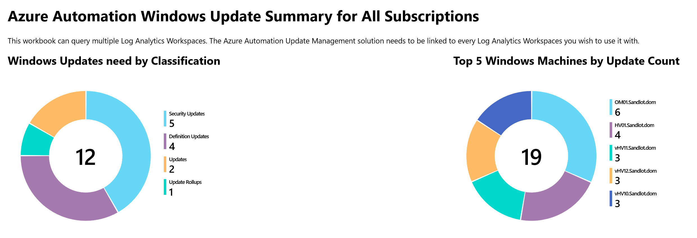
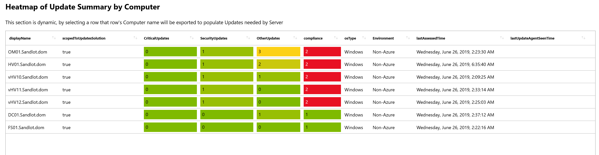
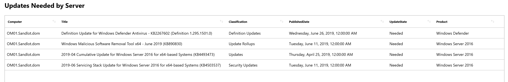

# Azure Monitor Update Management Patch Compliance Workbooks

The purpose of these Azure Monitor Workbooks is to provide patch compliance reporting for multiple Log Analytics workspaces.

To use them you need:
- Log Analytics workspace
- Azure Automation account
- Update Management Solution
- Azure Monitor Workbooks

The Log Analyitcs workspace and Azure Automation account need to be linked together.

## Related blog post
https://www.systemcenterautomation.com/2019/06/azure-automation-update-management-workbook/

## Install
For now you'll have to copy and paste the Gallery Template of the Workbook you want to use. You'll need to find and replace "replaceYourWorkspace" "replaceYourResourceGroup" and "replaceYourSubscription" or you can import and fix after the fact.

I would like to parameterize the ARM template for automated deployments, but the export has the workspace inside the serialized data. So if you have the time and know what you're doing feel free to improve that and submit a pull request.

## Screen Grabs

## GIF Output

## Improvements

Below are some improvements I will make when available or as time permits.

- Color Palette of pie charts, at present you cannot set them. The dev team for Workbooks is aware of this and working on it
- Heatmap for ScopedtoSolution, at present you can set a heatmap for boolean value, but it doesn't work unless you change true and false to 1 and 0.
- get LastUpdateAgentseenTime working
- Scope the entire workbook to the subscription(s) you want. As it is currently I have not found a way to scope all queries to all workspaces, you have to set it each time you create a new query.